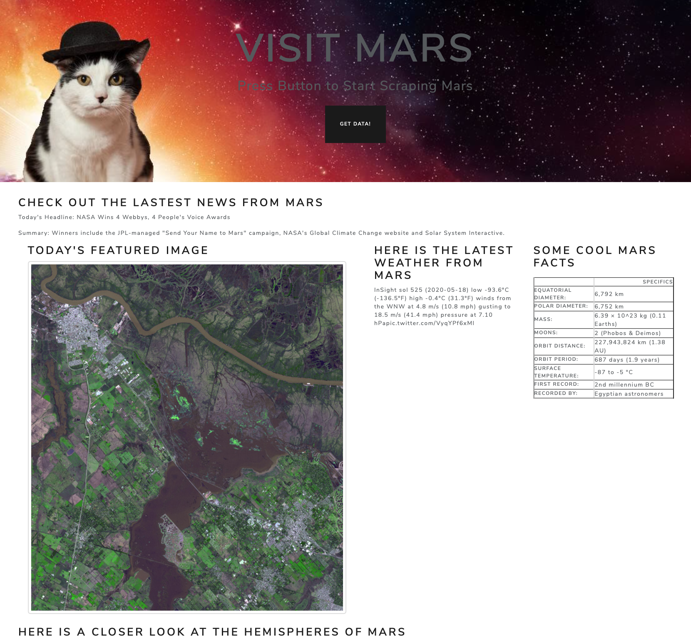
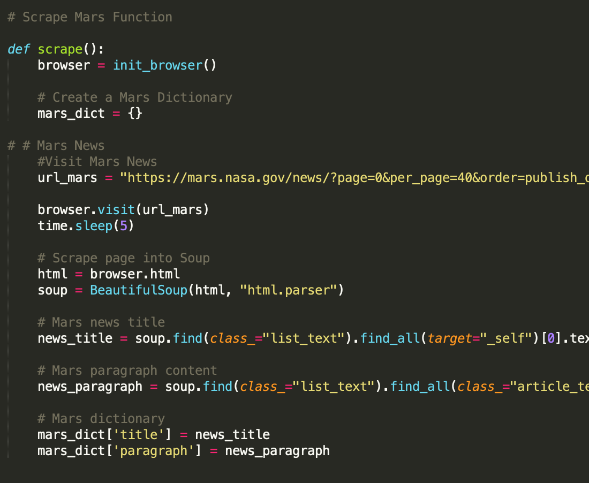

# Mission to Mars - Web Scraping 

## Summary 
This a web application that scrapes various websites for data related to the Mission to Mars and displays the information in a single HTML page. It gathers the lastest news from Mars each time you run the app. 

## Table of contents
* [Technologies](#technologies)
* [Setup](#setup)
* [Development](#development)
* [Sources](#sources)

## Technologies 
* Python: Beautiful Soup, Flask, numpy, pandas, pymongo, selenium, splinter
* MongoDB
* HTML, CSS, Bootstrap 

## Setup:
* Clone the repository
* In a python 3 environment, pip install requirements.txt
* Run Mongo in your terminal.
* In a new terminal window, open the directory folder
* Run the command "python scrape_mars.py" to get all the scraping get set up into Mongo
* Run the command "python app.py" 
* Open local host in your browser
* To get the latest news, "Get Data!" on the web page. 

## Development
### Scraping Sources
#### NASA Mars news 
* Scrapes the NASA Mars News Site and collects the latest News Title and Paragraph Text. 

#### JPL Mars Space Images - Featured Image
* Uses splinter to navigate the space image site and finds the image url for the current Featured Mars Image.

#### Mars Facts
* Visits the Mars Facts webpage and uses Pandas to scrape the table containing facts about the planet including Diameter, Mass, etc.
* Uses Pandas to convert the data to a HTML table string.

#### Mars Hemispheres
* Visits the USGS Astrogeology site here to obtain high resolution images for each of Mar's hemispheres.
* Appends the dictionary with the image url string and the hemisphere title to a list. 

### MongoDB and Flask Application
Uses MongoDB with Flask to create a new HTML page that displays all of the information that was scraped from the URLs above.

## Sources
* [NASA Mars News Site](https://mars.nasa.gov/news/)
* [JPL Featured Space Image](https://www.jpl.nasa.gov/spaceimages/?search=&category=Mars).
* [Mars Facts webpage](https://space-facts.com/mars/)
* [USGS Astrogeology site](https://astrogeology.usgs.gov/search/results?q=hemisphere+enhanced&k1=target&v1=Mars)

